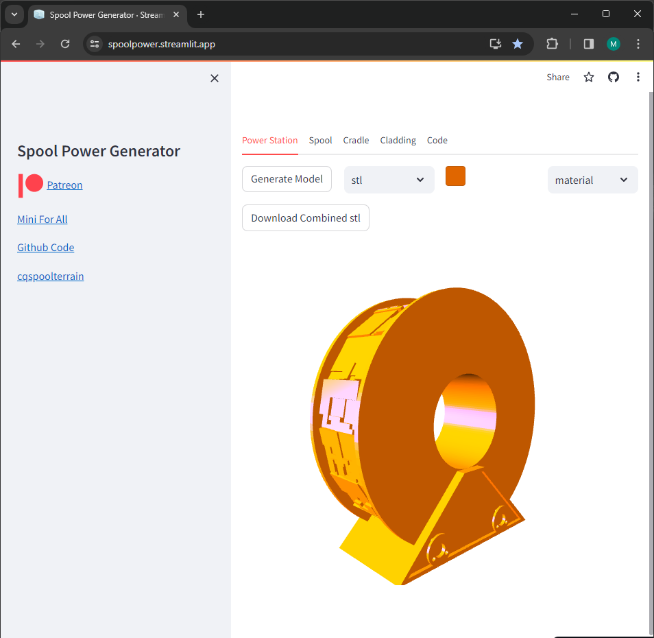

# CadQuery Spool Power Station Terrain - Streamlit Gui

 Streamlit App using code from [cqspoolterrain](https://github.com/medicationforall/cqspoolterrain) to generate parametric Spools and cradles. 
 
 Spools come in varying sizes, and one of the advantages to writing the code in cadquery is that the models are parametric. However having to  install and run python scripts is a barrier to entry.

I created this application https://spoolpower.streamlit.app/ to help with the technical barriers and allow for an interactive  demo.

The streamlit application allows you to define the dimensions of your spool and in turn effects the cradle and cladding parts.


[](https://spoolpower.streamlit.app//)

View the demo [spoolpower.streamlit.app](https://spoolpower.streamlit.app//)

### Features
* Modify size and attributes for the spool, cradle, and cladding of the Spool Powerstation
* View the individual models
* Download STL or STEP versions of the models
* Generates the cadquery code which can be run independent of the streamlit application. 
* All of the code is open source and can be run on your own machine.


## To Run Locally

1. Download the code
2. Open a command line where the code resides
3. Install requirements
    ```
    pip install -r requirements
    ```
4. Run the streamlit app
    ```
    streamlit run app/app.py
    ```
5. If everything worked; a browser should be opened to your local instance.